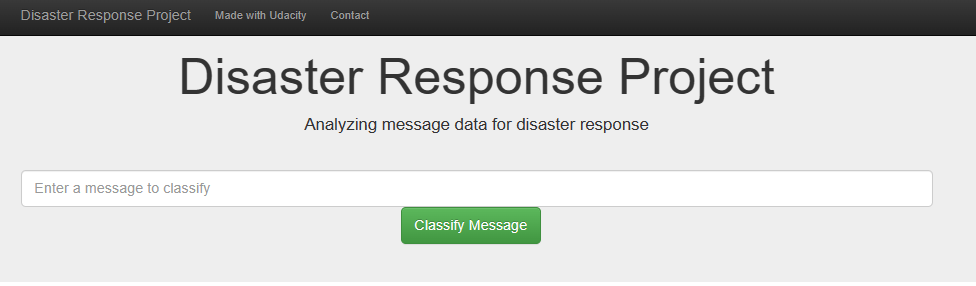
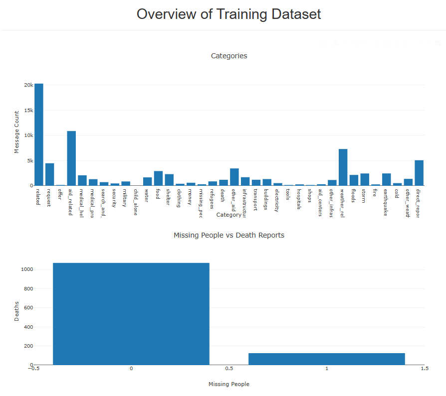

**Disaster Response Pipeline**

The project entails creating a machine learning pipeline to categorize messages during disaster events and send them to
the relevant people.

The end output is an app that a user can use to enter the message, and it will be categorized into the different emergency
event category.

The project includes the below files:

- Datasets:
  - messages.csv
    - Contains the list of the original messages as well as the english translations.
  - categories.csv
    - Contains the categories, and they are marked either 1 or 0, depending on whether the category applies or not.
- Jupyter notebooks:
  - ETL Pipeline:
    - Reads in the dataset which consists of 2 files, messages and categories, and combines into a single
    dataset. It further goes on to clean the dataset and creates an SQL database from the dataset.
  - ML Pipeline:
    - Reads in the Database created in the ETL pipeline. It then tokenizes the text by removing punctuations and stop words,
      and converts all to lower case. The data then gets split into the training and testing sets and run through an ML model,
      the model is then tuned through GridSearch and results output. The model is then exported to a pickle file.
- Python scripts
  - process_data.py:
    - Contains the code from the jupyter notebook for ETL pipeline.
    - To run: _"python process_data.py 'messages.csv categories.csv DisasterResponse.db"_
  - train_classifier.py:
    - Contains the code from the jupyter notebook for ML Pipeline.
    - To run: _"python train_classifier.py ../data/DisasterResponse.db model.pkl"_
  - run.py:
    - This is the Flask web app that provides the interface for the user to enter the message and will highlight the 
      related categories using the built pipelines.

**Libraries used:**

sys

Pandas

Scikit-learn

sqlalchemy

re

nltk

pickle

json

plotly

flask

Below the snips of the app.

**Acknowledgement**

This Dataset was acquired from Udacity for the purpose of this project.

