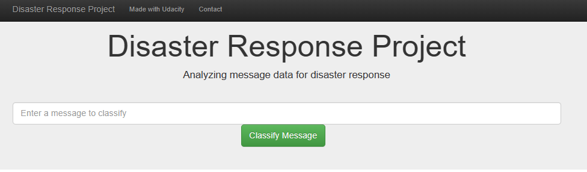
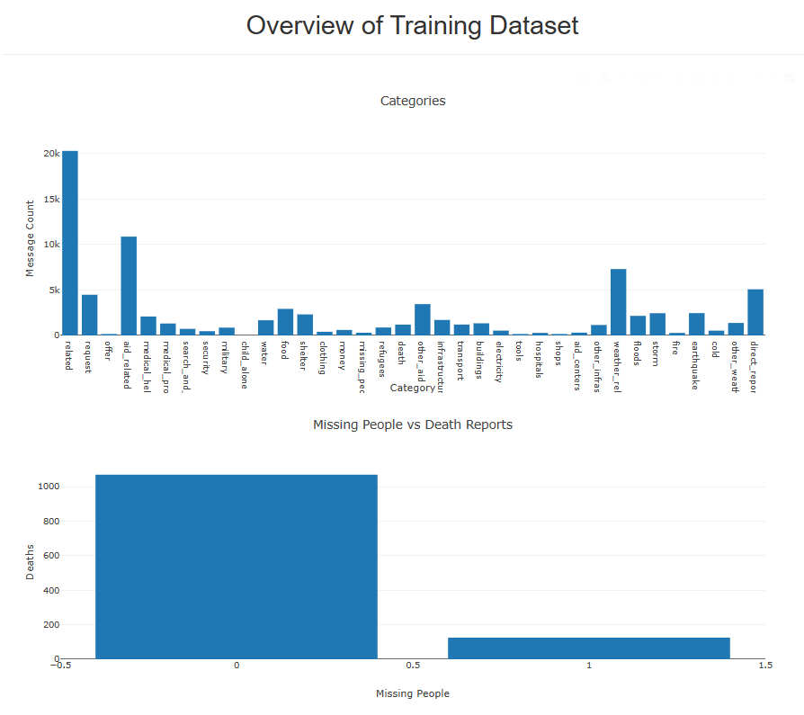

**Disaster Response Pipeline**

The project entails creating a machine learning pipeline to categorize messages during disaster events and send them to
the relevant people.

The end output is an app that a user can use to enter the message, and it will be categorized into the different emergency
event category.

The project includes the below files:

- Datasets:
  - messages.csv
    - Contains the 
- Jupyter notebooks:
  - ML Pipeline:
    - Reads in the dataset which consists of 2 files, messages and categories, and combines into a single
    dataset. It further goes on to clean the dataset and creates an SQL database from the dataset.
  - ML Pipeline:
    - Reads in the Database created in the ETL pipeline. It then tokenizes the text by removing punctuations and stop words,
      and converts all to lower case. The data then gets split into the training and testing sets and run through a ML model,
      the model is then tuned through GridSearch and results output. The model is then exported to a pickle file.

- Flask Web App:
  - Provides the interface for the user to enter the message and will highlight the related categories using the built 
    pipelines.

Libraries used:
sys
Pandas
Scikit-learn
sqlalchemy
re
nltk
pickle
json
plotly
flask

Below the snips of the app.

The dataset was acquired from kaggle, https://www.kaggle.com/datasets/iamsouravbanerjee/years-of-schooling-worldwide

**Acknowledgement**

This Dataset is created from Human Development Reports. This Dataset falls under the Creative Commons Attribution 3.0 IGO License. 

**Libraries used:
Pandas
Numpy
Seaborn
Matplotlib

An article elaborating on the findings is on the below link

https://medium.com/@mkaudi/analysis-on-the-expected-years-of-schooling-eys-metric-globally-14a94821606c
